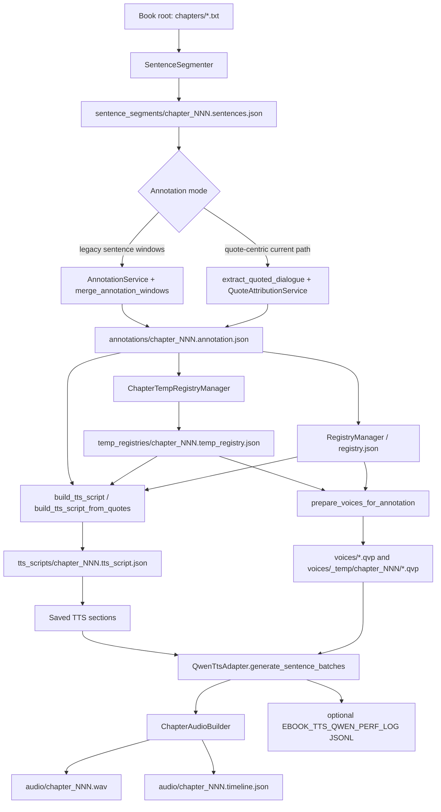

# Ebook TTS Pipeline Map

## Current Flow

## Module Responsibilities

- `src/ebook_tts_pipeline/pipeline.py`: orchestration, file handoff, voice preparation, section-window synthesis.
- `src/ebook_tts_pipeline/registry.py`: global recurring character records, voice profiles, profile-hash based voice regeneration.
- `src/ebook_tts_pipeline/temp_registry.py`: chapter-local speakers and temp voice paths.
- `src/ebook_tts_pipeline/annotation/quote_attribution.py`: quote-to-speaker attribution plus validation for local speakers and narrator quotes.
- `src/ebook_tts_pipeline/tts/script.py`: deterministic conversion from annotation/quotes into role-tagged TTS jobs and sections.
- `src/ebook_tts_pipeline/tts/qwen_adapter.py`: Qwen voice creation, generation block construction, multi-role voice clone calls, CUDA/performance telemetry.
- `src/ebook_tts_pipeline/audio.py`: streaming audio chunk assembly, final WAV stitching, sentence timeline emission.
- `src/ebook_tts_pipeline/windowing.py`: LLM and TTS section construction.

## Current Generation Semantics

- TTS sections are generation checkpoints.
- Within a section, contiguous same-role jobs are merged into generation blocks.
- `EBOOK_TTS_QWEN_MAX_GENERATION_BLOCKS_PER_CALL=0` means no static block-count slicing.
- `EBOOK_TTS_QWEN_MAX_GENERATION_BLOCK_CHARS=0` means no static same-role character slicing.
- Use `EBOOK_TTS_QWEN_PERF_LOG` to compare section shape, elapsed time, output samples/audio seconds, and CUDA peaks.

## Known Open Risks

- A fixed block cap is not an optimization strategy; it is only a temporary safety guard.
- The real chapter 13/14 timelines were generated before `voice_config_path` timeline audit existed.
- Existing chapter 13 audio proves old attribution allowed unused temp speakers; current validation rejects that state, but repair/retry is still not implemented.
- Chapter 14 narrator drift is not proven to be registry lookup; the likely unresolved test is mixed-batch voice leakage versus solo narrator generation.
