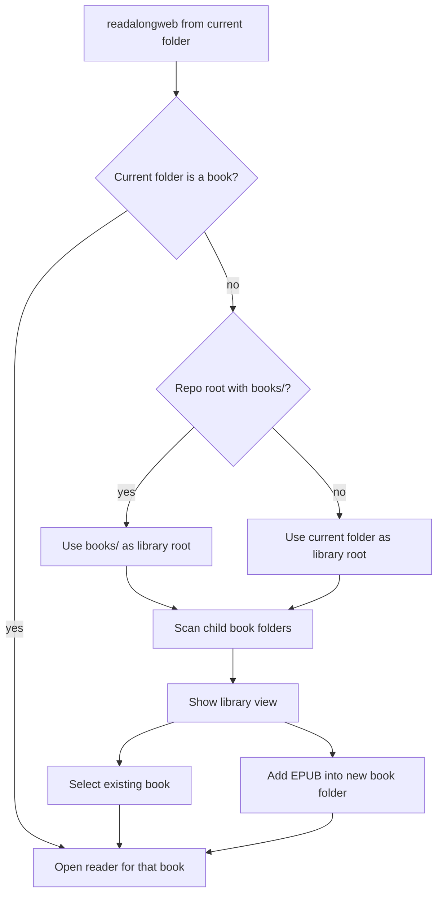

# Readalongweb Launcher Design

## Goal

Make the read-along web app launch like a local notebook: run `readalongweb` in a folder, open a local browser, and either enter the reader directly for one book or show a book library when multiple books are present.

## Startup Behavior

The launcher accepts a filesystem root instead of requiring an explicit book root. If the launch root itself contains a `chapters/` folder with chapter text files, it is treated as a single book and the existing reader opens directly. If the launch root contains child folders that look like books, the app opens in library mode and lists only those book folders. If the launch root is the repository root and contains a `books/` folder, the launcher uses `books/` as the default library root.

The short console command is `readalongweb`. The existing `ebook-tts-readalong-web` command remains as a compatibility alias.

## Library View

Library mode is functional, not a landing page. It shows discovered books with compact status counts: chapters, annotations, read-along unit files, registry, and voices. Non-book directories are hidden. Selecting a book switches the server state to that book and reveals the normal reader UI without restarting the server.

## Add Book Flow

The user can add an EPUB from the browser UI. The first implementation uses a local path field because the server is running on the same machine and the browser cannot reliably expose real local paths from a file picker. The UI asks for title and slug, creates `<library_root>/<slug>/`, extracts chapters, initializes registry/toc/sentence segments using the existing controller, registers the book in `library.json`, then selects it.

Full LLM processing remains explicit through `Process Book`. Adding a book should not silently run global registry and every chapter annotation because that can be long and expensive.

## Data Flow

## Testing

Tests cover root resolution, book discovery, direct book mode, library mode, selecting a book, adding a book through an injected fake extractor, and console script aliases. Existing read-along session tests continue to verify the reader/audio endpoints.
